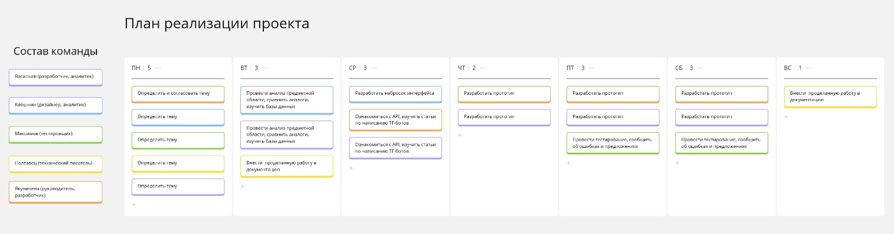
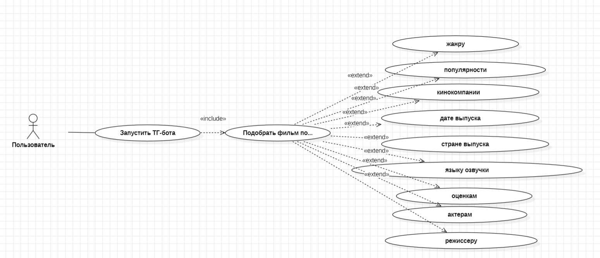
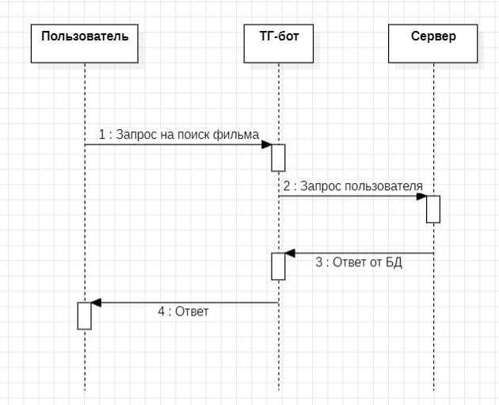

+-------------------+-----------------------+--------------------------+
|                   | {width=" |                          |
|                   | 0.9770833333333333in" |                          |
|                   | height="1.1in"}       |                          |
+-------------------+-----------------------+--------------------------+
| МИНОБРНАУКИ       |                       |                          |
| РОССИИ            |                       |                          |
+-------------------+-----------------------+--------------------------+
| Федеральное       |                       |                          |
| государственное   |                       |                          |
| бюджетное         |                       |                          |
| образовательное   |                       |                          |
| учреждение        |                       |                          |
|                   |                       |                          |
| высшего           |                       |                          |
| образования       |                       |                          |
|                   |                       |                          |
| **«МИРЭА --       |                       |                          |
| Российский        |                       |                          |
| технологический   |                       |                          |
| университет»**    |                       |                          |
|                   |                       |                          |
| **РТУ МИРЭА**     |                       |                          |
+-------------------+-----------------------+--------------------------+

Институт Информационных технологий

Кафедра Математического обеспечения и стандартизации информационных
технологий

**Отчет по практическим работам №1-4**

по дисциплине «Системная и программная инженерия»

+-----------------------------------+-----------------------------------+
| **Выполнил:**                     | Васильев Степан Викторович        |
|                                   |                                   |
| Студент группы ИВБО-08-22         | Клешнин Никита Арсеньевич         |
|                                   |                                   |
|                                   | Максимов Иван Сергеевич           |
|                                   |                                   |
|                                   | Полтавец Милена Юрьевна           |
|                                   |                                   |
|                                   | Якуничева Ирина Андреевна         |
+-----------------------------------+-----------------------------------+
| **Проверил:**                     | ассистент Квасова В.О.            |
+-----------------------------------+-----------------------------------+

МОСКВА 2025 г.

СОДЕРЖАНИЕ

[1 ОБСЛЕДОВАНИЕ ПРЕДМЕТНОЙ ОБЛАСТИ [3](#_Toc191310735)](#_Toc191310735)

[2 ОПРЕДЕЛЕНИЕ ФУНКЦИОНАЛЬНЫХ И ПОЛЬЗОВАТЕЛЬСКИХ ТРЕБОВАНИЙ
[4](#_Toc191310736)](#_Toc191310736)

[3 НАЧАЛЬНОЕ МОДЕЛИРОВАНИЕ ПРЕДМЕТНОЙ ОБЛАСТИ ПРОЕКТА
[6](#_Toc191310737)](#_Toc191310737)

[4 МАТРИЦА ТРЕБОВАНИЙ [8](#_Toc191310738)](#_Toc191310738)

[]{#_Toc191310735 .anchor}1 ОБСЛЕДОВАНИЕ ПРЕДМЕТНОЙ ОБЛАСТИ

Состав команды: Васильев, Клешнин, Максимов, Полтавец, Якуничева

Роли в команде: Васильев (разработчик, аналитик), Клешнин (дизайнер,
аналитик), Максимов (тестировщик), Полтавец (технический писатель),
Якуничева (руководитель, разработчик)

[Тема проекта: Интеллектуальная система подбора фильмов]{.mark}

[]{#_Toc191310736 .anchor}2 ОПРЕДЕЛЕНИЕ ФУНКЦИОНАЛЬНЫХ И
ПОЛЬЗОВАТЕЛЬСКИХ ТРЕБОВАНИЙ

Назначение проекта: пользователь хочет подобрать фильм для просмотра.

User story проекта:

1.  Пользователь хочет иметь возможность подбора фильмов по жанрам,
    чтобы просматривать фильмы, которые ему скорее всего понравятся.

2.  Пользователь хочет иметь возможность подбора фильмов по
    популярности, чтобы просматривать фильмы, которые знает большое
    количество людей.

3.  Пользователь хочет иметь возможность подбора фильмов по
    кинокомпаниям, чтобы сравнивать фильмы разных кинокомпаний.

4.  Пользователь хочет иметь возможность подбора фильмов по дате
    выпуска, чтобы просматривать фильмы, выпущенные в указанную дату.

5.  Пользователь хочет иметь возможность подбора фильмов стране выпуска,
    чтобы просматривать фильмы из определенной страны, которую сам
    выберет.

6.  Пользователь хочет иметь возможность подбора фильмов по
    оригинальному языку озвучки фильмов, чтобы просматривать фильмы без
    дубляжа.

7.  Пользователь хочет иметь возможность подбора фильмов по оценкам,
    чтобы просматривать самые высоко оцененные фильмы.

8.  Пользователь хочет иметь возможность подбора фильмов по актерам,
    чтобы просматривать фильмы с их участием.

9.  Пользователь хочет иметь возможность подбора фильмов по режиссеру,
    чтобы просматривать фильмы, которые он снял ранее. Функциональные
    требования -- система должна подобрать фильм(ы) по параметру(ам).

> Первоначальный план реализации проекта представлен на Рисунке 2.1.

{width="6.913194444444445in"
height="1.8173611111111112in"}

Рисунок 2.1 -- Первоначальный план реализации проекта

[]{#_Toc191310737 .anchor}3 НАЧАЛЬНОЕ МОДЕЛИРОВАНИЕ ПРЕДМЕТНОЙ ОБЛАСТИ
ПРОЕКТА

Портрет пользователя №1. Студент, который ищет что посмотреть вечером.

Иван, 20 лет.

Место проживания: Москва.

Семейное положение, количество детей: не женат, детей нет.

Сфера занятости и уровень зарплаты: студент, не работает.

Должность, связанные с ней проблемы: студент технического направления,
сложные и объемные в реализации курсовые проекты, вызывающие
эмоциональное напряжение.

Потребности, желания, фобии: чтобы отдохнуть после сложной
интеллектуальной работы ищет сервис по подбору фильмов для интересного
времяпрепровождения.

Портрет пользователя №2. Женщина, которая ищет варианты для семейного
просмотра.

Мария, 35 лет.

Место проживания: Химки.

Семейное положение, количество детей: замужем, трое детей.

Сфера занятости и уровень зарплаты: домохозяйка.

Должность, связанные с ней проблемы: высокая загруженность домашними
делами, отсутствие личного времени из-за постоянного нахождения рядом с
детьми.

Потребности, желания, фобии: заинтересовать детей на какое-то количество
времени, чтобы заняться личными делами в освободившееся время.

Диаграмма USE CASE диаграмму, в которой указаны основные требования к
системе представлена на Рисунке 3.1.

{width="6.925in" height="2.986111111111111in"}

Рисунок 3.1 -- Диаграмма USE CASE

Диаграмма последовательности представлена на Рисунке 3.2.

{width="4.098369422572178in"
height="3.324232283464567in"}

Рисунок 3.2 -- Диаграмма последовательности

[]{#_Toc191310738 .anchor}4 МАТРИЦА ТРЕБОВАНИЙ

1\. Определить нефункциональные требования для своей разработки.
Нефункциональных требований должно быть не менее 3 для каждого из
выбранных "разделов" и их составляют все члены команды.

2\. Сформировать матрицу требований для своей разработки. За матрицу
требований отвечает технический писатель.
